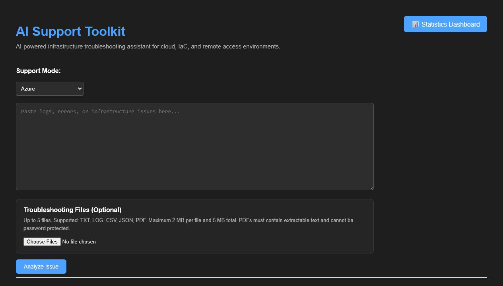
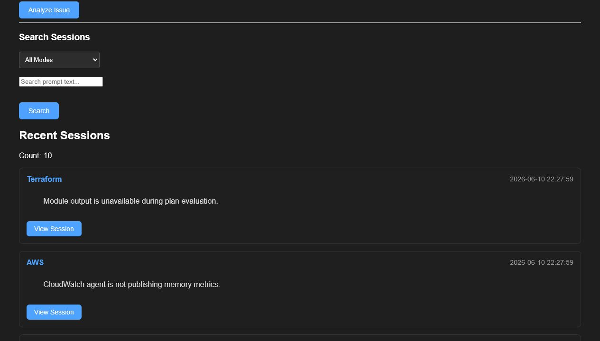
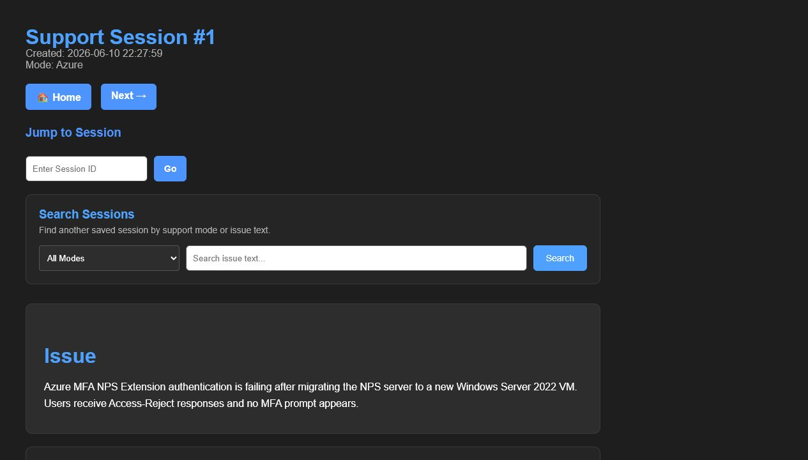
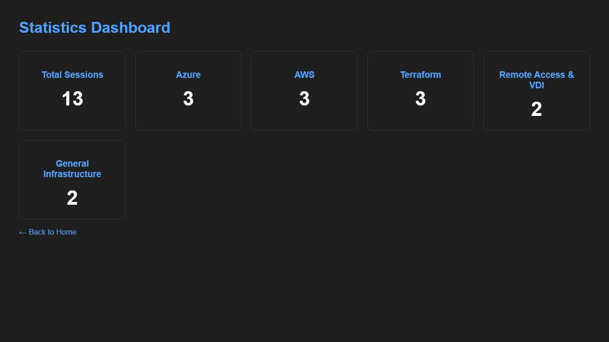
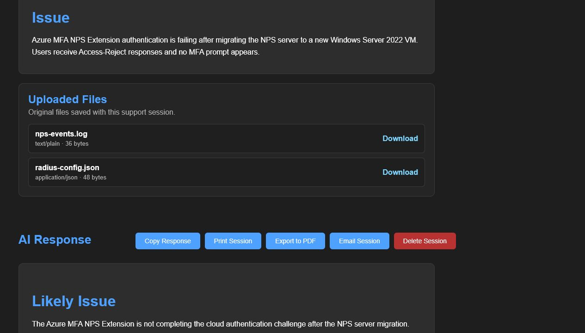
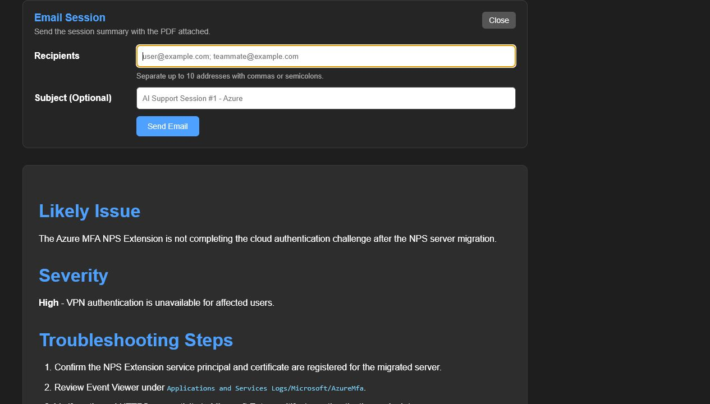

# AI Support Toolkit

AI Support Toolkit is a local Flask application that uses OpenAI to generate
structured troubleshooting guidance for cloud, infrastructure-as-code, and
remote-access support issues.

The project combines AI-assisted analysis with a searchable SQLite session
history, reusable session actions, and in-memory troubleshooting file uploads.
It was built as a practical support workflow and portfolio project rather than
as a production-ready service.

## Why This Project Exists

Infrastructure troubleshooting often involves collecting an issue
description, reviewing logs, organizing likely causes, and preserving the
result for follow-up. AI Support Toolkit brings those steps into one small web
application:

1. Select a support domain.
2. Describe the problem and optionally attach troubleshooting files.
3. Generate a structured AI response.
4. Save and search the resulting support session.
5. Copy, print, export, or email the saved response.

## Features

- Support modes for Azure, AWS, Terraform, Remote Access & VDI, and General
  Infrastructure.
- Structured AI troubleshooting responses with likely causes, severity,
  troubleshooting steps, commands, and additional notes.
- SQLite-backed session history.
- Session search by support mode and issue text.
- Pagination and a statistics dashboard.
- Previous, next, direct-ID, and text-search navigation for saved sessions.
- Delete-session confirmation and status feedback.
- Copy Response actions on current and saved responses.
- Browser-based session printing.
- PDF export with a meaningful session filename.
- Email delivery through environment-configured SMTP with the session PDF
  attached.
- Multiple in-memory file uploads for TXT, LOG, CSV, JSON, and text-based PDF
  files.
- Original validated uploads saved with their session for later download.
- Upload validation, safe error messages, and extraction limits.

## Tech Stack

- Python 3
- Flask and Jinja
- SQLite
- OpenAI Python SDK
- Markdown
- `xhtml2pdf` for PDF generation
- `pypdf` for PDF text extraction
- HTML, CSS, and small amounts of browser JavaScript

## Screenshots

All screenshots use invented demo data. No OpenAI request or email delivery was
performed while capturing them.

| Main dashboard | Session history |
| --- | --- |
|  |  |

| Saved session | Statistics dashboard |
| --- | --- |
|  |  |

| Saved uploads | Email session |
| --- | --- |
|  |  |

See [the screenshot guide](docs/screenshots/README.md) for capture and
sanitization details.

## Architecture Overview

AI Support Toolkit uses a small server-rendered architecture:

```text
Browser
  |
  v
Flask routes and Jinja templates
  |                  |
  |                  +--> SQLite session history and file attachments
  |
  +--> Prompt builders --> OpenAI API
  |
  +--> PDF generation --> Download or SMTP email attachment
```

- `app.py` owns route handling and workflow orchestration.
- `prompts/` builds support-mode-specific instructions.
- `services/openai_service.py` calls OpenAI and converts Markdown to HTML.
- `services/file_upload_service.py` validates uploads and extracts text.
- `database/db.py` stores sessions and original validated attachments.
- `templates/` and `static/style.css` provide the server-rendered interface.

See [ARCHITECTURE.md](ARCHITECTURE.md) for route, data-flow, and trust-boundary
details.

## Installation

### Prerequisites

- Python 3.10 or newer
- An OpenAI API key
- Optional SMTP account for Email Session
- Docker Desktop or another Docker-compatible engine for container deployment

### Set Up the Project

Clone or download the repository, then run these commands from the project
root:

```powershell
python -m venv venv
.\venv\Scripts\Activate.ps1
python -m pip install --upgrade pip
pip install -r requirements.txt
```

For macOS or Linux, activate the environment with:

```bash
source venv/bin/activate
```

## Environment Variables

Create a local `.env` file from `.env.example` and provide only the values
needed for your environment:

```dotenv
OPENAI_API_KEY=
SMTP_HOST=
SMTP_PORT=
SMTP_USERNAME=
SMTP_PASSWORD=
SMTP_FROM_EMAIL=
SMTP_USE_TLS=true
```

`OPENAI_API_KEY` is required for AI analysis. SMTP settings are required only
for Email Session. `SMTP_USERNAME` and `SMTP_PASSWORD` must either both be
provided or both be left blank. `SMTP_USE_TLS` defaults to `true`.

| Variable | Required | Purpose |
| --- | --- | --- |
| `OPENAI_API_KEY` | Yes | Authenticates OpenAI analysis requests and is needed when the application starts. |
| `SMTP_HOST` | Email only | SMTP server hostname. |
| `SMTP_PORT` | Email only | SMTP server port, commonly `587` for STARTTLS. |
| `SMTP_USERNAME` | Provider-dependent | SMTP login username; requires `SMTP_PASSWORD`. |
| `SMTP_PASSWORD` | Provider-dependent | SMTP login password; requires `SMTP_USERNAME`. |
| `SMTP_FROM_EMAIL` | Email only | Valid sender address accepted by the SMTP provider. |
| `SMTP_USE_TLS` | No | Enables STARTTLS when `true`; defaults to `true`. |

Never commit `.env` or place real credentials in screenshots, documentation,
issue reports, or source code.

## Running Locally

Run commands from the project root because the SQLite database currently uses
a relative path:

```powershell
.\venv\Scripts\Activate.ps1
python app.py
```

Open:

```text
http://127.0.0.1:5000
```

Running `app.py` starts Flask's development server with debug mode disabled. It
is intended for local development only.

## Docker Deployment

The container runs the application with Gunicorn rather than Flask's
development server. It listens on container port `8000`, runs as a non-root
user, and stores SQLite data in `/data`.

### Build the Image

```powershell
docker build --tag ai-support-toolkit:latest .
```

### Run with an Environment File

Create `.env` from `.env.example`, then run:

```powershell
docker volume create ai-support-toolkit-data

docker run --detach `
  --name ai-support-toolkit `
  --env-file .env `
  --publish 8000:8000 `
  --mount source=ai-support-toolkit-data,target=/data `
  --restart unless-stopped `
  ai-support-toolkit:latest
```

Open:

```text
http://127.0.0.1:8000
```

Check status and logs:

```powershell
docker ps
docker logs ai-support-toolkit
```

Stop and remove the container without deleting its database volume:

```powershell
docker stop ai-support-toolkit
docker rm ai-support-toolkit
```

The named volume preserves sessions and uploaded attachments across container
replacement. Remove it only when the stored data is no longer needed:

```powershell
docker volume rm ai-support-toolkit-data
```

For Bash shells, replace PowerShell backticks with backslashes or put the
`docker run` arguments on one line.

### Container Notes

- The image deliberately uses one Gunicorn worker with four threads because
  SQLite is the current persistence layer.
- The container includes an HTTP health check against `/`.
- `.env`, the local SQLite database, virtual environments, caches, and local
  build artifacts are excluded from the image context.
- SMTP remains optional. Without valid SMTP settings, Email Session displays a
  configuration error while the rest of the application remains available.
- Docker improves packaging and process startup, but it does not add
  authentication, CSRF protection, TLS termination, rate limiting, or other
  missing application security controls.

## Using the App

1. Select a support mode.
2. Enter an issue description.
3. Optionally attach supported troubleshooting files.
4. Select **Analyze Issue**.
5. Review the structured AI response and saved-session confirmation.
6. Copy the response or open the saved session for additional actions.

See [docs/USAGE.md](docs/USAGE.md) for detailed workflows and upload limits.

## Example Workflow

1. Select **Azure** support mode.
2. Describe a sanitized authentication or infrastructure issue.
3. Attach relevant TXT, LOG, CSV, JSON, or text-based PDF evidence.
4. Generate and review the structured troubleshooting response.
5. Open the saved session from history.
6. Download the original attachments for context.
7. Copy, print, export, or email the session PDF.
8. Delete the demonstration session when it is no longer needed.

## Session History Workflow

Each successful analysis saves:

- Session ID
- Local timestamp
- Support mode
- Original issue text
- Rendered AI response

Original validated files are saved as SQLite attachments and can be downloaded
from the session detail page. Extracted prompt text is not stored separately.

From the home page or a session page, users can search issue text, filter by
support mode, open recent sessions, navigate between sessions, or jump directly
to a session ID.

Saved-session actions include:

- **Copy Response**: copies readable response text.
- **Print Session**: opens the browser print workflow with print-specific
  formatting.
- **Export to PDF**: downloads `support-session-<id>.pdf`.
- **Email Session**: sends a controlled session summary with the generated PDF
  attached to as many as ten comma- or semicolon-separated recipients.
- **Delete Session**: removes only the selected SQLite session after
  confirmation.

## File Upload Support

Analysis requests may include up to five files:

- `.txt`
- `.log`
- `.csv`
- `.json`
- `.pdf` with extractable text

Current limits:

- 2 MB per file
- 5 MB combined file size
- 6 MB total request size
- 30,000 extracted characters per file
- 75,000 extracted characters total

Extracted text is processed in memory and marked `[TRUNCATED]` when an
extraction limit is reached. Accepted original files are stored with the saved
session for later download. Encrypted PDFs, image-only PDFs, unsupported types,
and binary content disguised as text are rejected. OCR is not included.

## Security Notes

This application handles potentially sensitive issue descriptions and logs.
Use demo or sanitized data whenever possible.

Important current limitations:

- No authentication or authorization.
- No CSRF protection.
- AI-generated HTML is rendered as stored HTML.
- No rate limiting.
- No automated secret redaction.
- No formal retention or backup workflow.
- SQLite and the Flask development server are intended for local,
  low-concurrency use.
- SMTP delivery is synchronous and provider configuration varies.

Do not expose this application directly to untrusted networks without further
security and deployment work. See
[docs/SECURITY_NOTES.md](docs/SECURITY_NOTES.md) for more detail.

## Known Limitations

- The application is not production-ready.
- Automated tests and continuous integration are not currently configured.
- Filtered search results are not paginated.
- Password-protected and image-only PDFs are not supported.
- Email delivery depends on a correctly configured external SMTP provider.
- Docker packaging is implemented; cloud-platform deployment configuration is
  not included.

## Future Roadmap

Planned or recommended work includes:

- Add focused automated tests.
- Add CSRF protection and safer HTML handling.
- Improve session navigation when IDs contain gaps.
- Define retention, backup, and redaction guidance.
- Add platform-specific reverse proxy, TLS, monitoring, and backup guidance.

See [TASKS.md](TASKS.md) for the working roadmap and
[ARCHITECTURE.md](ARCHITECTURE.md) for implementation details. Contributor
conventions are documented in
[docs/MAINTAINER_GUIDE.md](docs/MAINTAINER_GUIDE.md).

## Project Structure

```text
.
|-- app.py
|-- Dockerfile
|-- .dockerignore
|-- database/
|   `-- db.py
|-- docs/
|   |-- MAINTAINER_GUIDE.md
|   |-- SECURITY_NOTES.md
|   |-- USAGE.md
|   `-- screenshots/
|-- prompts/
|-- services/
|   |-- file_upload_service.py
|   `-- openai_service.py
|-- static/
|   `-- style.css
|-- templates/
|-- ARCHITECTURE.md
|-- TASKS.md
`-- requirements.txt
```

## Project Status

AI Support Toolkit v1.0 is feature complete for local use and portfolio
demonstration. The repository intentionally does not claim public-internet
production readiness, hosted deployment support, authentication, or
comprehensive security hardening.
